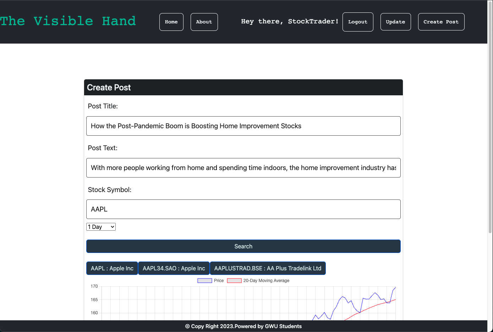

# Project3

## Table of Contents

1. [Team](#team)
2. [Description](#description)
3. [Technologies](#technologies)
4. [App](#app)
5. [Installation](#installation)
6. [Screenshot](#screenshot)
7. [Heroku](#heroku)
8. [Repository](#repository)
9. [Credits](#credits)

## Team
Andre Brahin, Brian McDonell, Suvarna Jadhav, Alexander Nunez

## Description 
We are a dedicated and active forum passionate about navigating the treacherous Stock Market. Using our unique and intuitive tools within the website, consumers can better grasp and trade ideas regarding current stock market values. Our Team of passionate coders from The George Washington University Coding Bootcamp has made this site using innovative tools found in the competitive business environment. The encompassing goal of the Visible Hand is to help fellow nerds eager to have a safe and inclusive forum where ideas and Stock Market hypothetical conclusions can be shared and conversed.

## Technologies 
The technologies used are Mongoose ODM, NodeJS, ExpressJS, React, GraphQL, bcrypt, Chart.JS, Alpha Vantage, dotenv, authentication JWT, Apollo Server, BootStrap which come together to make The Visible Hand a deployable app!

## App 

Below is a screenshot and GitHub repository that shows both the client and server side of the app with the multitude of files between them. On the consumer side you will see how new consumers can create accounts, update accounts, post comments, comment on other posts, and use the React App as a functional blog site. Also, the link to the deployable Heroku site.

## Installation

Install the dependencies
Seed the Databse on Mongoose
Add enviroment variables for the full use of the application
Run the application from package.json

## Screenshot

Here is what the Main Page looks like:

Here is what clicking on a single post looks like:

Here is what creating a post looks like:

## Heroku

https://cryptic-anchorage-50091.herokuapp.com/

## Repository

https://github.com/VenBak/The-Visible-Hand

## Credits

Suvarna Jadhav
https://github.com/suvarna28

Brian McDonell
https://github.com/bpmcdonell

Andre Brahin
https://github.com/VenBak

Alexander Nunez
https://github.com/braddahis

